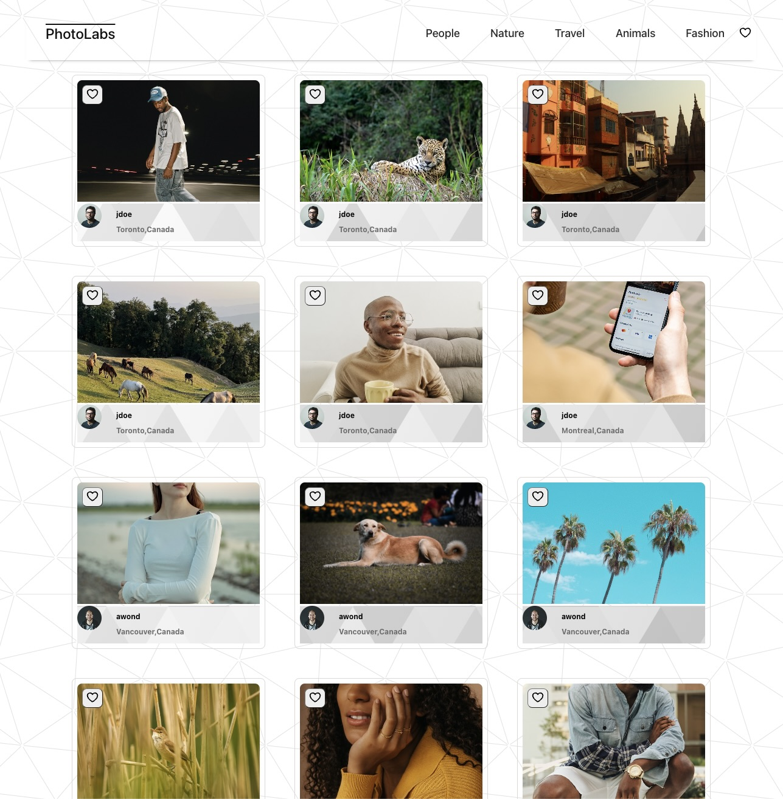
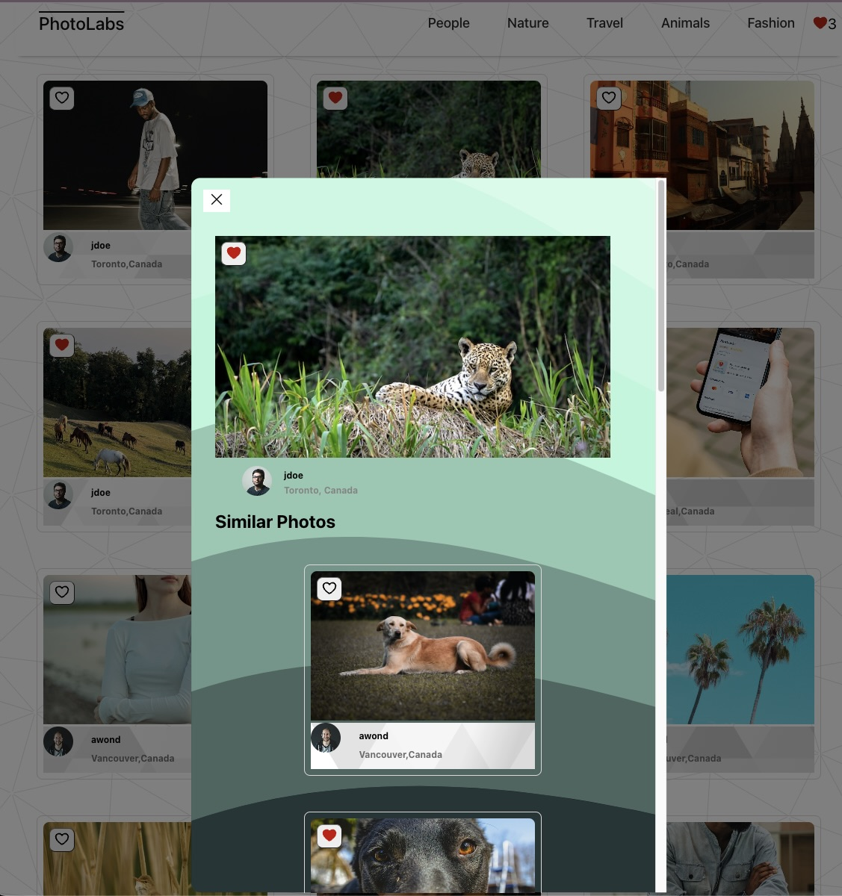

# Welcome to PhotoLabs 📸



Welcome to PhotoLabs, a unique photo viewing app born out of my passion for React and web development during my studies at Lighthouse Labs. Let's dive into what makes PhotoLabs a fantastic project and how you can get it up and running.


## What's PhotoLabs?

PhotoLabs is a single-page application (SPA) built with React. Our goal was simple: craft a delightful, user-friendly platform for photo exploration. It's all about delivering an immersive experience, where every click brings a new surprise, and every photo tells a story.

### Features at a Glance



- **View Photos**: Dive into a sea of images! From the homepage, you're one click away from discovering an [array] of stunning photos.
- **Explore Topics**: Got a theme in mind? Navigate through different photo categories and let your curiosity guide you.
- **Enlarge and Enjoy**: Click on any photo to see its larger version and get lost in its details.
- **Like to Love**: Found something you adore? Hit 'like' and add it to your favorites.
- **Notifications with Heart**: Our cute little heart icon in the navigation bar keeps track of your liked photos.

## Behind the Scenes

At the core of PhotoLabs is a tech stack we're really excited about. The front end is powered by React. On the back end, we rely on a reliable PostgreSQL database and a Node.js server using Express.js.


## Getting Started

Ready to get PhotoLabs running on your machine? Follow these steps, and you'll be set in no time.

### Setup

First things first, let's get those dependencies in place:

```sh
# Navigate to the frontend and backend directories to install dependencies
cd frontend
npm install
cd ../backend
npm install
```

### Running PhotoLabs
#### Backend
For the backend, check out backend/readme for detailed setup instructions. Then:

```sh
cd backend
npm start
```

#### Frontend

Start the frontend server to bring the PhotoLabs client to life:

```sh
cd frontend
npm start
```

### Parting Words

I hope you enjoy exploring PhotoLabs as much as I loved building it. Dive in, play around, and don't forget to tell me what you think!

Happy coding and happy photo viewing! 🎉📷💻